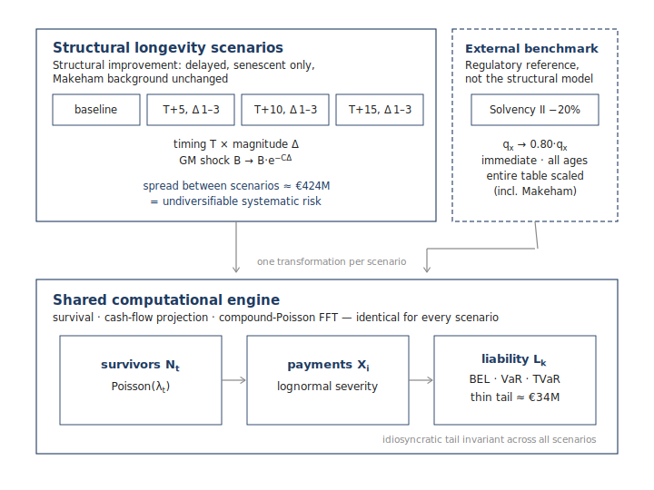

# Longevity Risk Modelling

**Computational actuarial modelling of longevity risk using Gompertz–Makeham mortality, compound-Poisson aggregation, Fast Fourier Transform (FFT), and structural longevity scenarios.**

---

## Overview

This repository contains a fully reproducible actuarial modelling framework for analysing **idiosyncratic** and **systematic** longevity risk in a stylised occupational pension fund.

The implementation combines classical actuarial techniques with modern scientific computing in Python. The emphasis is on transparency, reproducibility, computational efficiency and independent validation.

The accompanying technical note demonstrates how structural longevity scenarios can be analysed through an exact aggregate liability distribution computed using Fast Fourier Transform (FFT) convolution.

---

## Main Results

The project illustrates several important actuarial observations:

- Individual longevity risk diversifies efficiently in large pension portfolios.
- Systematic longevity improvements remain largely undiversifiable.
- Interest-rate assumptions generally have a substantially larger financial impact than plausible longevity changes.
- Exact FFT aggregation provides an efficient alternative to large-scale Monte Carlo simulation while producing identical results.

---

## Features

- Gompertz–Makeham mortality model
- Income-segmented mortality calibration
- Structural longevity scenario analysis
- Independent Solvency II benchmark
- Compound-Poisson liability model
- Exact FFT aggregation
- Best Estimate Liability (BEL)
- Value-at-Risk (VaR)
- Tail Value-at-Risk (TVaR)
- Independent Monte Carlo validation
- Fully reproducible figures and tables

---

## Repository Contents

| File | Description |
|------|-------------|
| `LongevityRisk.ipynb` | Complete computational implementation |
| `LongevityRisk.pdf` | Technical note describing the methodology, assumptions and results |

---

## Requirements

Python 3.12 or later.

Main packages:

- NumPy
- Pandas
- SciPy
- Matplotlib
- aggregate (Stephen J. Mildenhall)

---

## Purpose

This repository accompanies the technical note and provides a transparent, reproducible research implementation.

It is intended for educational, actuarial and research purposes rather than production use.

Comments, suggestions and constructive criticism are welcome.

---

## Author

**Erik Van Releghem**
